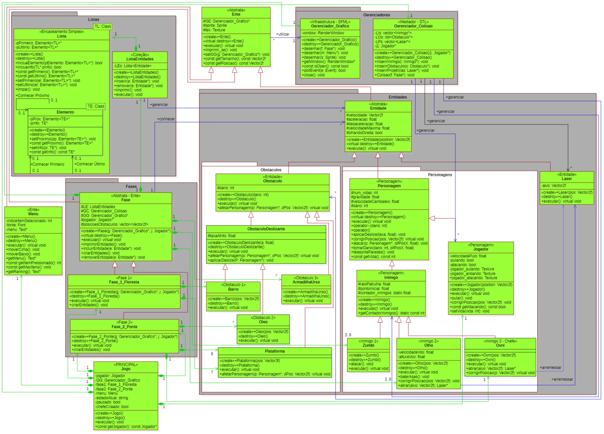

#### :us: [English](README.md) | :brazil: [Português](LEIAME.md)

# Hallowcura
Comme projet de conclusion du cours de Techniques de Programmation, le développement d'un jeu numérique qu'appliquait le contenu enseigné a été requis. Pour ce faire, le jeu Hallowcura a été développé, dans lequel le joueur doit se battre pour vaincre ses ennemies en évitant des obstacles pendant deux phases courtes.Le jeu a été développé selon les exigences présentées via document de texte et diagramme de classes générique en Langage de Modélisation Unifié (Unified Modeling Language - UML) fourni par le professeur de la discipline. Après avoir étudié les exigences, le cycle de développement s'est débuté, en contemplant la concrétisation du diagramme de classes, implémentation (en le langage de programmation C++) et tests des ressources nouvellement ajoutés. Le développement a compté sur l'application de concepts basiques et avancés du paradigme orienté objets, comme objets et relations et polymorphisme et modèles, respectivement.

## Diagramme de classes

    <i>Diagramme de classes.</i> 

## Configuration requise
  | Configuration Requise | |
  | ------------ | :------------: |
  | Système d'exploitation |  Windows (XP ou plus récent), Linux ou macOS. |
  | CPU  | Architecture x86, x64 avec prise en charge du jeu d'instructions SSE2.  |
  | Exigences supplémentaires  | Pilotes officiellement pris en charge.  |
  |API graphique| Capable de DX10, DX11, DX12.|

## Contrôles
  | Actions          | Clavier & souris |       Mannete de jeu     |
  |:----------------:|:----------------:|:------------------------:|
  | Sauter           | W ou UpArrow    | L3 (en haut) ou DPadUp    |
  | Tomber           | S ou DownArrow  | L3 (en bas) ou DPadDown   |
  | Bouger à droite  | D ou RightArrow | L3 (droite) ou DPadRight  |
  | Bouger à gauche  | A ou LeftArrow  | L3 (gauche) ou DPadLeft   |
  | Mettre en pause  | Esc             | Start/Options             |

## Équipe
#### Regian Canuto dos Santos
GitHub - https://github.com/Hashhat

#### Nicolas Barbieri Sousa
LinkedIn - https://linkedin.com/in/nicolasbsousa/ 
Portfolio - https://nickalverst.github.io/

#### Lucas Silvério da Silva (artiste)
LinkedIn - https://www.linkedin.com/in/lucas-silv%C3%A9rio-255526193  
Instagram - https://www.instagram.com/lukethe117  
ArtStation - https://www.artstation.com/lukethe117  

Developpé dans **Windows 10** en utilisant l'IDE **Visual Studio Community 2019** version 16.11.15 soutenu par la bibliothèque graphique **SFML-2.5.1** pour des ordinateurs de 32 bits.
